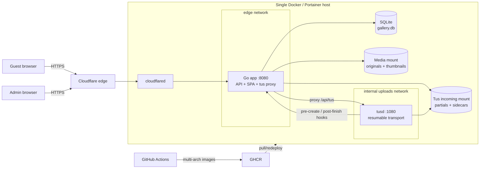

# Wedding Gallery Architecture

## 1. System summary

Wedding Gallery is a single-event, self-hosted photo/video gallery. Guests use one public page to upload and browse media without accounts. A password-protected admin page manages optional upload approval, trash, upload expiry, audit history, text, and colors.

The design optimizes for:

- reliable mobile uploads over an ordinary internet connection;
- simple single-NAS operation and backup;
- no public inbound NAS ports;
- minimal infrastructure: one Go app, tusd, SQLite, and filesystem storage.

It deliberately does **not** provide multi-tenant accounts, horizontal scaling, high availability, permanent trash purge, or distributed processing.

## 2. High-level design

No host ports are published. `cloudflared` reaches the app on the `edge` network. Only the app bridges `edge` and the internal-only `uploads` network, so browsers cannot reach tusd directly.

## 3. Components

### React SPA (`frontend/src`)

- `App.tsx` selects guest or admin UI from the URL path; there is no client router.
- `UploadPanel.tsx` uses Uppy + tus-js-client with 8 MiB chunks, retries, resumability, file restrictions, and whole-file SHA-256 duplicate preflight.
- `Gallery.tsx` / `useGallery.ts` own cursor pagination, sorting, infinite scroll, post-upload polling, and background item merging.
- React Photo Album lays out thumbnails; YARL provides the image/video lightbox, swipe, keyboard navigation, and native video controls.
- Guest name and a casual per-device like ID live in browser `localStorage`; neither is authentication.
- `AdminApp`, `AdminDashboard`, and `AdminBrandingEditor` implement login, pending-upload approval, moderation, audit/config views, and plain-text/color customization.
- `api/client.ts` is the same-origin JSON API boundary and attaches the device ID plus admin CSRF header when required.

The production Vite build is embedded into the Go binary. Unknown non-API paths fall back to `index.html`, enabling direct `/admin` loads.

### Go application (`backend/cmd/server`, `backend/internal`)

The app owns:

- public gallery, media, like, config, and duplicate-check APIs;
- admin authentication, sessions, CSRF, moderation, audit, expiry, and branding APIs;
- the reverse proxy from public `/api/tus` to internal tusd `/files`;
- tus hook validation and completed-upload ingestion;
- MIME sniffing, SHA-256, EXIF/ffprobe metadata, video rotation, thumbnails, and filesystem placement;
- SQLite migrations and all application state.

Global middleware adds panic recovery, JSON request logging, security headers, and trusted-proxy-aware client IP resolution.

### tusd

`tusd` is the resumable transport layer. It stores upload data/offset sidecars in the incoming mount, enforces maximum size, and calls the app for:

- `pre-create`: reject invalid size or missing filename before creation;
- `post-finish`: validate and ingest a completed file.

The app injects a shared hook secret and resolved client IP into proxied requests; tusd forwards them to hooks. The proxy also rewrites tusd's internal `Location` response to the public same-origin `/api/tus/{id}` route.

### SQLite and filesystem

SQLite uses WAL, foreign keys, a 5-second busy timeout, and embedded ordered migrations.

| Storage | Contents |
|---|---|
| `/data/app` | `gallery.db`, WAL, SHM |
| `/data/media/originals` | canonical uploaded originals |
| `/data/media/thumbnails` | generated JPEG thumbnails |
| `/data/tusd-incoming` | partial/completed tus files and `.info` sidecars before ingestion |

Core tables:

- `media_items`: metadata, unique SHA-256, active/trashed status, and nullable approval timestamp;
- `likes`: unique `(media_id, device_id)` likes;
- `audit_log`: best-effort administrative/upload history;
- `admin_sessions`: server-side session and CSRF tokens;
- `app_config`: upload expiry and atomic branding JSON.

## 4. Main request flows

### Browse and view

1. SPA requests `/api/config/public` and `/api/gallery`.
2. Go reads active media from SQLite using an opaque cursor and upload-time or capture-time sort.
3. Grid loads generated thumbnails.
4. Lightbox streams originals; Go uses `http.ServeContent`, so video byte-range seeking works.
5. Downloads use the original attachment endpoint.

### Upload

1. Browser streams SHA-256 computation in 8 MiB slices.
2. `/api/uploads/check` skips a known duplicate as a bandwidth optimization.
3. Uppy creates a tus upload through `/api/tus/` and sends 8 MiB PATCH requests.
4. The app applies per-IP request, concurrent-PATCH, and bandwidth policies, then proxies to tusd.
5. tusd persists chunks and offsets, allowing HEAD-based resume after interruption.
6. After transport completion, tusd calls the app's `post-finish` hook. Transport completion can precede gallery processing completion.
7. The app magic-sniffs content, enforces the allowlist, computes authoritative SHA-256, and moves/copies the original into media storage.
8. Images receive EXIF orientation/capture-time handling and JPEG thumbnails. Videos receive ffprobe metadata (including display rotation) and ffmpeg thumbnails.
9. The app rejects checksum mismatch/unsupported content and discards known duplicates. Otherwise, the same serialized SQLite insert auto-approves when moderation is off or leaves `approved_at` null when it is on.
10. With moderation off, the SPA polls and merges processed items without remounting. With moderation on, guest polling/backoff is a no-op and the uploader shows an awaiting-approval confirmation.

Client-side hashing is optional optimization; server sniffing, hashing, and SQLite's unique SHA constraint are authoritative.

### Admin

1. Password-only login is rate-limited and compared in constant time.
2. A random server-side session is stored in SQLite.
3. The browser receives a Secure, HttpOnly session cookie and a CSRF token; every mutating admin request must echo the token in `X-CSRF-Token`.
4. Admin actions bulk-approve pending media, change media status, update upload expiry/branding/moderation, or read audit data.
5. Disabling moderation and approving every pending row is one SQLite transaction, so uploads cannot remain pending after the toggle completes.

Trash is a **soft database status change**. Files remain under `originals`; there is currently no permanent purge API. Pending and trashed media use authenticated admin thumbnail routes and return 404 from public media/like routes.

## 5. Reliability and protection

- tus provides resumable, retryable chunk transport; 8 MiB requests stay below common reverse-proxy body limits.
- Maximum file size is enforced by the browser config, app pre-create hook, and tusd.
- Content type is determined from magic bytes, not filename or client MIME.
- SHA-256 is recomputed by the server; SQLite uniqueness closes concurrent duplicate races.
- Upload expiry blocks only new upload creation; existing uploads, browsing, and downloads continue.
- Approval is off by default. When enabled, new completed uploads are admin-only until approved; disabling it atomically publishes all pending media.
- Per-IP token buckets, PATCH concurrency, and bandwidth controls are process-local and intentionally generous for guests sharing venue NAT.
- Limiter/session cleanup runs in background goroutines; media processing itself runs inline in tus hooks, not in a queue.
- App/tusd containers use read-only roots, dropped capabilities, `no-new-privileges`, non-root Compose identities, and writable bind mounts only where required.

## 6. Deployment and operations

GitHub Actions runs Go tests/vet/build and frontend lint/typecheck/tests/build, then publishes `amd64` and `arm64` app/tusd images to GHCR. Portainer deploys the Git-backed Compose file by pulling those images; immutable commit/release tags are preferable to `latest`.

Health checks are intentionally shallow:

- app: SQLite ping via `/healthz`;
- tusd: `/metrics` response;
- cloudflared: no repository-defined health check.

Operational visibility is JSON stdout logs, Portainer container state/logs, SQLite audit rows, and the guarded production tus load-test harness under `loadtest/`.

For a consistent backup:

1. stop the stack;
2. back up app-data and media together;
3. preserve deployment secrets/configuration and image revision separately;
4. restart the stack.

The tus incoming volume is transient resumability state. Excluding it from backup abandons in-progress uploads but does not lose completed gallery media.

## 7. Scaling and tradeoffs

This is a KISS single-node design.

**Strengths**

- few moving parts and low idle resource use;
- no exposed NAS ports;
- strong resumable upload path;
- simple, consistent stop-the-stack backup;
- browser, API, transport, and processing responsibilities are clearly separated.

**Limits**

- SQLite, local mounts, and in-memory limiters assume one app replica;
- no HA, object store, external queue, distributed locks, or worker autoscaling;
- concurrent completions can amplify hashing, copying, image decode, and ffmpeg work;
- abandoned tus partials and soft trash require capacity monitoring;
- whole-file browser hashing saves duplicate bandwidth but costs phone CPU/battery;
- original images/videos are served directly, so lightbox bandwidth can be high.

A larger multi-event service would separate API, object storage, metadata database, and asynchronous media workers. That complexity is intentionally deferred here.

## 8. Known gaps

- Media filesystem changes and SQLite inserts are not one transaction. A crash between moving a file and inserting its row can leave an orphan; there is no reconciler.
- Trash never purges files; abandoned tus uploads have no configured expiration policy.
- App health does not verify media/upload mount writability, free space, ffmpeg, tusd reachability, or tunnel connectivity.
- Audit writes are best effort and are not an authoritative transaction log.
- Like/device identity is client-asserted and intended only for casual deduplication.
- When approval is off, post-upload appearance is polling-based; processing rejection/timeout has no dedicated status endpoint.
- Rolling back to a pre-approval binary while pending rows exist would expose them because old queries do not understand `approved_at`; rollback requires the matching pre-migration backup.
- Branding defaults are duplicated in Go and TypeScript and must remain synchronized.

## 9. Source map

| Concern | Primary files |
|---|---|
| Startup/config | `backend/cmd/server/main.go`, `backend/internal/config/config.go` |
| Routes/middleware/auth | `backend/internal/httpapi/server.go`, `middleware.go`, `auth.go` |
| Public/admin API | `public.go`, `admin.go`, `branding.go` |
| Tus proxy/hooks | `tus_proxy.go`, `tus_hooks.go`, `deploy/tusd-entrypoint.sh` |
| Media processing | `backend/internal/media/*` |
| Database/store | `backend/internal/db/*`, `backend/internal/store/*` |
| Guest/admin SPA | `frontend/src/App.tsx`, `components/*`, `hooks/*` |
| Deployment/CI | `Dockerfile*`, `docker-compose.yml`, `.github/workflows/containers.yml` |
| Production load test | `loadtest/README.md`, `loadtest/tus_battle.py` |
